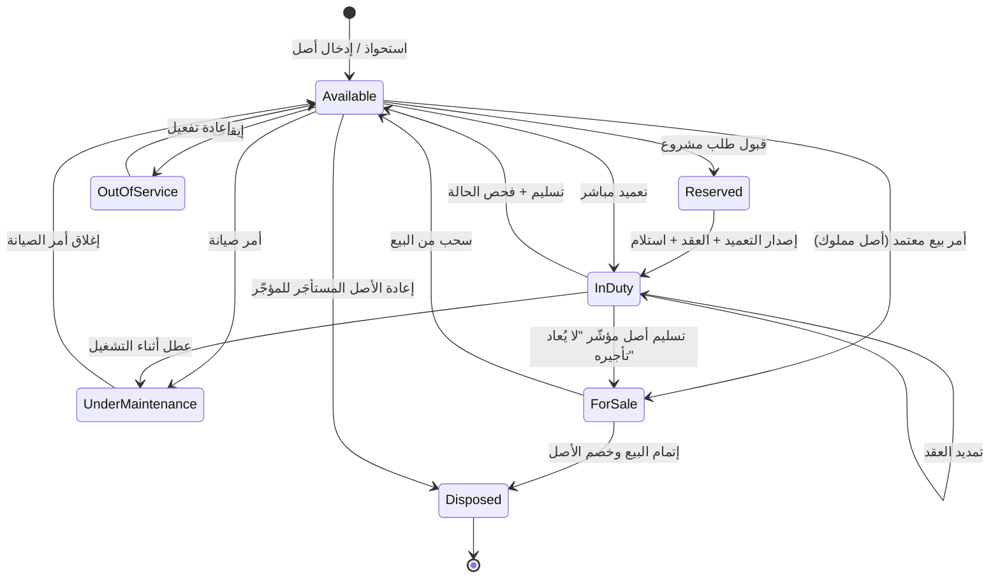
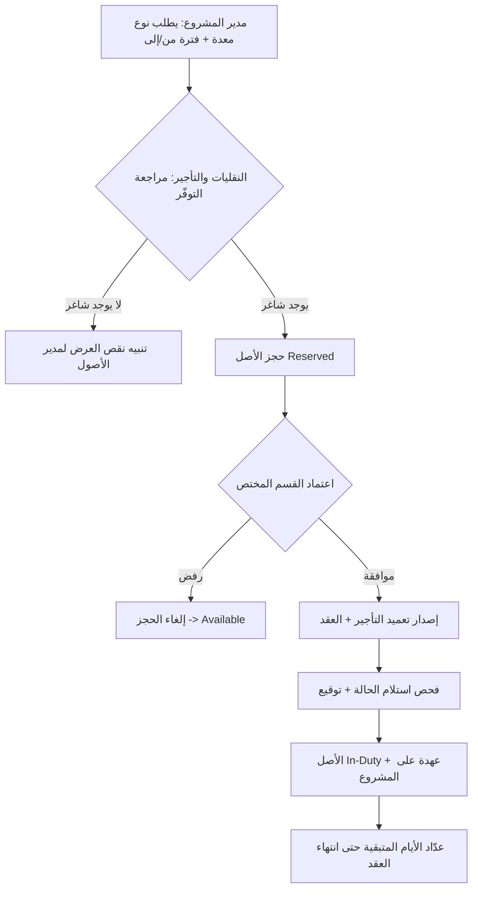

# منصة إدارة وتشغيل الأصول — التصوّر الكامل
### Equipment Asset & Operations Management Platform

> نظام داخلي يدير دورة حياة الشاحنات والمعدات من الرصد المحاسبي → التأجير الداخلي على المشاريع → الصيانة → الاستلام والتسليم → قرار التجديد/البيع، مع حوكمة كاملة وفصل للمهام وسجل تدقيق لكل حركة.

---

## 1. الفلسفة والمبادئ الحاكمة

المنصة ليست مجرد سجل أصول، بل **نظام تشغيل** يربط ثلاث دورات في منظومة واحدة:

1. **دورة الأصل المحاسبية** — رصد الأصل، قيمته الدفترية، إهلاكه، ومستنداته.
2. **دورة التشغيل/التأجير** — تخصيص الأصل للمشاريع كعهدة بموجب عقد، وقياس إشغاله.
3. **دورة الصيانة والحالة** — رصد الأعطال والصيانة وتتبّع تدهور الحالة عبر فحوصات الاستلام/التسليم.

**المبادئ المعيارية المعتمدة:**

- **مرجعية ISO 55000** لإدارة الأصول: كل قرار (تجديد/بيع/شراء) مبني على بيانات التكلفة الإجمالية للملكية (TCO) والحالة والإشغال، لا على التقدير.
- **فصل المهام (Segregation of Duties):** من يطلب ≠ من يعتمد ≠ من ينفّذ الصيانة ≠ من يستلم/يسلّم.
- **مصدر حقيقة واحد (Single Source of Truth):** حالة الأصل لحظية ومحكومة بـ State Machine، لا تُعدّل يدوياً إلا بصلاحية.
- **كل حركة موثّقة:** لا تأجير بلا تعميد وعقد، ولا تسليم بلا فحص حالة، ولا صيانة بلا أمر وكرت ومستند.
- **الصلاحيات تحكم العرض:** كل بوابة ترى فقط ما يخصّها (Row-Level + Field-Level Security).

---

## 2. الأدوار والبوابات (Personas & Portals)

| الدور | النطاق | أهم الصلاحيات والإجراءات |
|---|---|---|
| **السوبر أدمن** | شامل | إدارة المستخدمين والصلاحيات، البيانات المرجعية (أنواع المعدات/المشاريع/الإدارات)، إعداد مسارات الاعتماد، الاطّلاع الكامل، سجل التدقيق |
| **مدير الأصول** (Asset Manager) | كل الأصول | الإشراف على دورة حياة الأصل، اعتماد القرارات الكبرى (تجديد/بيع)، لوحة مؤشرات الأسطول |
| **إدارة النقليات والتأجير** (تحت الأصول) | الأصول + الطلبات | استقبال طلبات المشاريع، الموافقة/الرفض، إصدار التعميد والعقد، إدارة الشاغر والمحجوز، تنفيذ التسليم/الاستلام |
| **إدارة الصيانة** | أوامر الصيانة | استقبال أوامر الصيانة، تعبئة كرت الصيانة، رفع الفواتير وكشوف الفحص، إغلاق الأوامر |
| **مدير المشروع** | مشروعه فقط | طلب معدة/شاحنة، متابعة عهدته، تمديد العقد أو طلب التسليم، تأكيد الاستلام عند المشروع |
| *(مستقبلاً)* المالية / السلامة والفحص / إدارات أخرى | حسب النطاق | الإهلاك والقيود، متابعة الاستمارات والفحص الدوري، توسعة لإدارات إضافية |

> **مبدأ التوسعة:** صُمّم النموذج بحيث تُضاف «إدارة طالبة» جديدة كـ Tenant/Org Unit دون إعادة هندسة — المشروع اليوم، وغداً أي إدارة تطلب أصلاً.

---

## 3. نموذج البيانات الأساسي (Core Entities)

| الكيان | أهم الحقول | العلاقات |
|---|---|---|
| **Asset** (الأصل) | الرقم التسلسلي، النوع، الموديل/السنة، **نوع الملكية (مملوك / مستأجَر خارجياً)**، تاريخ الشراء، القيمة الدفترية، نسبة الإهلاك، الحالة الحالية، الموقع | يملك مستندات، عقود، أوامر صيانة، فحوصات |
| **AssetType** (نوع المعدة) | الفئة (شاحنة/حفّار/...)، الوحدة، المواصفات القياسية | يصنّف الأصول؛ يُستخدم في الطلب |
| **VehicleInfo** (للشاحنات) | رقم اللوحة، الاستمارة وتاريخ انتهائها، الفحص الدوري، كرت التشغيل، البطاقة الجمركية | 1:1 مع الأصل |
| **Driver** (السائق) | الاسم، الإقامة/الرخصة، تواريخ الانتهاء، المستندات | يُربط بأصل/عقد |
| **AssetDocument** | النوع (رخصة سير/جمركية/كرت تشغيل/...)، الملف، تاريخ الانتهاء | يتبع أصلاً أو عقداً أو أمر صيانة |
| **RentalContract** (عقد/تعميد التأجير) | رقم التعميد، المشروع، من/إلى، الحالة، قيمة التأجير، أيام متبقية | يربط أصل ↔ مشروع |
| **HandoverInspection** (بيان الاستلام/التسليم) | النوع (استلام/تسليم)، قائمة فحص الحالة، الصور، الملاحظات، التوقيع | يتبع عقداً (نقطتان: بداية ونهاية) |
| **MaintenanceWorkOrder** (أمر صيانة) | المصدر، الوصف، الأولوية، الحالة، التكلفة | يتبع أصلاً |
| **MaintenanceCard** (كرت الصيانة) | الأعمال المنفّذة، قطع الغيار، الفنّي، الفواتير، كشف الفحص | يتبع أمر صيانة |
| **SaleOrder** (أمر البيع) | الأصل، تاريخ الأمر، السعر المطلوب، الحالة (مقترح/معتمد/قيد البيع/مُباع/ملغى)، المشتري، سعر البيع الفعلي، مستندات البيع | يتبع أصلاً مملوكاً |
| **ExternalLeaseContract** (عقد الاستئجار الخارجي) | المورّد، الأصل، الأجرة الدورية، من/إلى، شروط الصيانة والتأمين (من يتحمّلها)، التزام الإعادة | يتبع أصلاً مستأجَراً + مورّد |
| **Supplier/Vendor** (المورّد) | الاسم، بيانات التواصل، نوع التعامل (بيع/تأجير)، المستندات | يرتبط بعقود الاستئجار/الشراء |
| **Project** (المشروع) | الاسم، مدير المشروع، الإدارة، الحالة | يملك عهدة (عقود سارية) |
| **User / Role / Permission** | المستخدم، الدور، نطاق الوصول، الصلاحيات الدقيقة | تحكم كل البوابات |
| **AuditLog** | الفاعل، الإجراء، الكيان، قبل/بعد، الوقت | يغطّي كل حركة |

---

## 4. دورة حياة الأصل وحالاته (Asset State Machine)

الحالة لحظية ومحكومة، ولا تتغيّر إلا بإجراء مصرّح به:

| الحالة | المعنى |
|---|---|
| **Available / شاغر** | متاح للتخصيص |
| **Reserved / محجوز** | محجوز ضمن طلب لم يصدر تعميده بعد |
| **In-Duty / قيد التشغيل** | مؤجّر فعلياً على مشروع بعقد ساري |
| **Under Maintenance / تحت الصيانة** | أمر صيانة مفتوح |
| **Out of Service / خارج الخدمة** | موقوف مؤقتاً |
| **For Sale / معروض للبيع** | صدر أمر بيع معتمد — مستبعَد من قائمة التأجير والتسليم للمشاريع |
| **Disposed / مستبعَد** | خرج من الأسطول (مباع، أو مُعاد للمؤجّر إن كان مستأجَراً) |

> **تأشير البيع أثناء التشغيل:** لو كان الأصل `In-Duty` ويُراد بيعه، يُؤشّر عليه «لا يُعاد تأجيره» فلا يدخل قائمة الشاغر بعد تسليمه، بل ينتقل مباشرة إلى `For Sale`. أما الأصل **المستأجَر خارجياً** فلا يُباع، وإنما يخرج بمسار **الإعادة للمؤجّر** عند انتهاء عقد الاستئجار.

---

## 5. ملف الأصل (Asset Profile) — التابات

عند فتح أي أصل، تظهر التابات التالية، وكلها تحترم صلاحيات المستخدم:

1. **معلومات عامة** — الهوية، النوع، الموديل، الشراء، الموقع، والحالة اللحظية.
2. **بيانات الشاحنة/المعدة** — اللوحة، الاستمارة وانتهاؤها، الفحص الدوري، كرت التشغيل، السائق المرتبط *(للشاحنات)*.
3. **المستندات** — رفع وحفظ صور رخصة السير، البطاقة الجمركية، كرت التشغيل، مستندات السائق… مع **تنبيه انتهاء** لكل مستند له تاريخ صلاحية.
4. **أوامر الصيانة** — كل أمر صادر على الأصل وكرته وفواتيره وكشوف الفحص.
5. **عقود التأجير والتشغيل** — كل عقد + بيان الاستلام والتسليم المرتبط به وحالة الأصل عند كل طرف.
6. **المالية والإهلاك** — نوع الملكية، القيمة الدفترية والإهلاك (للمملوك) أو الأجرة الدورية والتزام الإعادة (للمستأجَر)، والتكلفة الإجمالية للملكية (TCO) محسوبة حسب نوع الملكية *(مرئي بصلاحية)*.
7. **الخط الزمني / السجل** — تسلسل كل الأحداث (تأجير، صيانة، تسليم) كسجل تدقيق.
8. **مؤشرات الأصل** — إشغاله، تعطّله، تكلفة صيانته، اتجاه تدهور حالته.

---

## 6. المسارات التشغيلية (Workflows)

### 6.1 مسار الطلب والتأجير (Request → Dispatch)

**ما يُنتجه المسار:** تعميد برقم، عقد بمدة محددة، عهدة مرصودة على المشروع، وحالة `In-Duty` مع معلومات المشروع وتاريخ/وقت انتهاء العقد وعدّاد الأيام المتبقية لإتاحة الأصل مجدداً.

### 6.2 مسار التمديد / التسليم (Extend / Return)
- **تمديد:** مدير المشروع يطلب التمديد → اعتماد → تحديث مدة العقد والعدّاد. (يبقى `In-Duty`).
- **تسليم:** مدير المشروع يباشر التسليم → **فحص تسليم الحالة** يقارن بحالة الاستلام → ترصد التلفيات/التغيّرات وتُنسب للعقد والمشروع → الأصل يعود `Available`.

### 6.3 مسار الصيانة (Maintenance Work Order)
1. يصل/يُنشأ أمر صيانة (من المشاريع أو من النقليات أو فحص دوري).
2. مدير الصيانة أو موظفوه يدخلون من بوابة الصيانة، يفتحون الأمر، الأصل يصبح `Under Maintenance`.
3. تعبئة **كرت الصيانة** (الأعمال، قطع الغيار، الفنّي) ورفع **الفواتير وكشوف الفحص**.
4. إغلاق الأمر → ترحيل التكلفة على الأصل → عودته `Available`.

### 6.4 مسار قرار دورة الحياة (Renew / Sell / Buy)
- المنصة ترصد لكل أصل: التكلفة التراكمية للصيانة مقابل القيمة الدفترية، تكرار الأعطال، تدهور الحالة عبر الفحوصات، ونسبة الإشغال.
- عند تجاوز عتبات محددة (مثلاً تكلفة صيانة سنوية > نسبة من القيمة الدفترية، أو تكرار أعطال) → **تنبيه قرار** لمدير الأصول بالتجديد/البيع.
- عند تكرار **نقص العرض** (طلبات لا تُلبّى لعدم وجود شاغر) → مؤشر استحواذ (شراء أو استئجار خارجي).
- القرار يقارن **الشراء مقابل الاستئجار الخارجي** (CapEx مقابل OpEx) بحسب مدة الحاجة ونسبة الإشغال المتوقعة.

### 6.5 مسار التصفية والبيع (Disposal / Sale)

```mermaid
flowchart TD
    A[مدير الأصول: تسجيل أمر بيع على أصل مملوك] --> B{اعتماد البيع}
    B -->|رفض| Z[يبقى الأصل في وضعه السابق]
    B -->|اعتماد| C[الأصل For Sale + إخفاؤه من قائمة التأجير]
    C --> D[ظهوره في قسم الأصول المعروضة للبيع]
    D --> E{نتيجة العملية}
    E -->|سحب من البيع| F[عودته Available]
    E -->|إتمام البيع| G[إدخال المشتري + سعر البيع + مستندات البيع]
    G --> H[الأصل Disposed + خصمه من الأصول]
    H --> I[احتساب ربح/خسارة البيع = سعر البيع − القيمة الدفترية]
```

**القواعد الحاكمة:**
- أمر البيع يُسجّله **مدير الأصول** فقط، ويمر باعتماد (فصل مهام: من يقترح ≠ من يعتمد).
- بمجرد اعتماده، الأصل `For Sale` **ولا يظهر** ضمن الأصول القابلة للتأجير أو التسليم للمشاريع.
- **قسم مستقل: «الأصول المعروضة للبيع»** يعرض كل شاحنة/معدة معروضة، يدير تفاصيل العرض (سعر مطلوب، صور، حالة)، ويقفل العملية بالبيع أو بالسحب.
- عند إتمام البيع: خصم الأصل من السجل، وحفظ مستندات البيع (عقد، نقل ملكية)، واحتساب **ربح/خسارة البيع** مقابل القيمة الدفترية.
- هذا القسم سيتطوّر لاحقاً كـ **مكتب تصفية وتجديد الأسطول** يربط قرار البيع بقرار الاستحواذ البديل.

### 6.6 مسار الاستحواذ الخارجي (Acquisition: Purchase or External Rental)

قسم لإدخال أصول جديدة إلى القائمة، يلبّي إشارة نقص العرض، وله نوعان يختلفان جذرياً في التكاليف:

| | **أصل مملوك (شراء)** | **أصل مستأجَر خارجياً** |
|---|---|---|
| **التكلفة الثابتة (CapEx)** | سعر الشراء يُرسمل كأصل | لا يوجد رأس مال — لا يدخل دفاتر الملكية |
| **التكلفة المستمرة (OpEx)** | إهلاك + صيانة + تأمين + استمارة/فحص | **أجرة دورية للمورّد** + ما تتحمّله الشركة من صيانة/تأمين حسب العقد |
| **الإهلاك** | يُحتسب وينقص القيمة الدفترية | لا إهلاك (الأصل ليس مملوكاً) |
| **نهاية الحياة** | بيع (مسار 6.5) | **إعادة للمؤجّر** عند انتهاء عقد الاستئجار |
| **عقد مرتبط** | فاتورة/أمر شراء | **ExternalLeaseContract** بمدة والتزام إعادة |
| **حساب TCO** | الإهلاك + التشغيل | الأجرة الدورية + ما تتحمّله من تشغيل |

> الأصل المستأجَر خارجياً **يدخل قائمة الأصول ويُؤجَّر على المشاريع كأي أصل** (يظهر `Available` ويصير `In-Duty`)، لكن المنصة تُميّز تكاليفه ونهاية حياته. وهذا التمييز ضروري حتى تكون مقارنة الجدوى (شراء مقابل استئجار) ومؤشرات TCO دقيقة.

---

## 7. الاستلام والتسليم وفحص الحالة (Condition Capture)

هذا قلب الحوكمة. لكل عقد نقطتا فحص:

- **عند الاستلام:** قائمة فحص منظّمة (إطارات، هيكل، محرّك، عدّاد التشغيل/الكيلومترات، ملحقات…) + صور + توقيع الطرفين → تُثبّت الحالة المرجعية.
- **عند التسليم:** نفس القائمة تُعاد، والنظام **يقارن** ويُبرز الفروقات (Diff) لرصد أي تلف، ويُنسبه للعقد والمشروع المسؤول.
- النتيجة: **سجل حالة تراكمي** لكل أصل يعطي مؤشراً دقيقاً لتدهور الحالة عبر الزمن — وهو ما يغذّي قرار التجديد/البيع.

---

## 8. إدارة العهد على المشاريع (Custody Ledger)

كل مشروع يرى لوحته الخاصة:
- عدد المعدات/الشاحنات السارية كعهدة.
- لكل عهدة: نوع الأصل، رقم العقد، تاريخ الانتهاء، الأيام المتبقية، الحالة.
- تنبيهات بالعقود التي تقارب الانتهاء (لاتخاذ قرار التمديد/التسليم مبكراً).

---

## 9. الصلاحيات وعرض البيانات (RBAC + Scope Security)

نموذج ثلاثي الطبقات:

1. **حسب الدور (Role-Based):** ماذا يستطيع المستخدم أن يفعل (طلب/اعتماد/صيانة/إدارة).
2. **حسب النطاق (Row-Level):** أي صفوف يرى — مدير المشروع يرى مشروعه فقط؛ الصيانة ترى أوامرها؛ الأصول ترى الكل.
3. **حسب الحقل (Field-Level):** الحقول الحسّاسة (القيمة الدفترية، الإهلاك، قيمة العقد) تظهر فقط لمن له صلاحية مالية.

> كل بوابة تُبنى على نفس الـ API لكن مع **تطبيق الصلاحية على مستوى الاستعلام** لا على مستوى الواجهة فقط — لضمان عدم تسرّب البيانات.

---

## 10. المؤشرات و KPIs لكل بوابة

**مدير الأصول / السوبر أدمن (لوحة الأسطول):**
- نسبة الإشغال (Utilization Rate) ومعدل التوفّر (Availability).
- معدل التعطّل (Downtime) والتكلفة الإجمالية للملكية (TCO) لكل أصل.
- أعمار الأسطول وتوزيع الحالات، والأصول المرشّحة للتجديد/البيع.
- **مزيج الملكية:** نسبة المملوك مقابل المستأجَر خارجياً، وCapEx مقابل OpEx للأسطول.
- **التصفية:** عدد الأصول المعروضة للبيع، متوسط مدة البيع، وربح/خسارة البيع مقابل القيمة الدفترية.
- **الاستحواذ:** الأصول الداخلة حديثاً، ومؤشر جدوى الشراء مقابل الاستئجار حسب الإشغال المتوقع.

**النقليات والتأجير:**
- عدد العقود السارية، والطلبات المعلّقة، وزمن الاستجابة للطلب.
- الشاغر مقابل المطلوب (مؤشر نقص العرض)، ومعدل التمديد.

**الصيانة:**
- MTBF (متوسط الزمن بين الأعطال) و MTTR (متوسط زمن الإصلاح).
- تكلفة الصيانة لكل أصل، الأوامر المفتوحة، ونسبة الوقائية مقابل التصحيحية، والأصول كثيرة الأعطال.

**المشاريع:**
- عدد المعدات بالعهدة، العقود المنتهية قريباً، وتكلفة التأجير لكل مشروع.

---

## 11. لوحة السوبر أدمن

- إدارة المستخدمين والإدارات والأدوار والصلاحيات الدقيقة.
- البيانات المرجعية: أنواع المعدات، المشاريع، الإدارات، عتبات التنبيه.
- إعداد مسارات الاعتماد (من يعتمد ماذا).
- الاطّلاع الكامل على كل المدخلات والمخرجات من جميع البوابات.
- سجل التدقيق (AuditLog) وإعدادات التنبيهات.

---

## 12. التنبيهات والأتمتة (Notifications)

- قرب انتهاء **الاستمارة / الفحص الدوري** لأي شاحنة.
- قرب انتهاء **مستند** له تاريخ صلاحية (رخصة، إقامة سائق…).
- قرب انتهاء **عقد تأجير** (للمشروع وللنقليات).
- تجاوز أصل **عتبة تكلفة الصيانة** → تنبيه قرار التجديد.
- **نقص العرض** المتكرر → تنبيه استحواذ (شراء/استئجار).
- قرب انتهاء **عقد استئجار خارجي** → تنبيه قرار (تجديد العقد أو إعادة الأصل للمؤجّر).

---

## 13. المعمارية التقنية المقترحة

- **الواجهة:** React (متعدد البوابات، ثنائي اللغة عربي/إنجليزي مع دعم RTL).
- **الـ Backend:** API موحّد مع طبقة صلاحيات على مستوى الاستعلام.
- **قاعدة البيانات:** PostgreSQL — مناسبة للعلاقات والسلامة المرجعية و Row-Level Security.
- **المستندات:** تخزين كائني (Object Storage) للملفات والصور مع روابط مؤمّنة.
- **المهام الخلفية:** Jobs للتنبيهات وحساب المؤشرات والعدّادات.
- **التصميم متعدّد المستأجرين/الإدارات (Multi-Org Ready):** ليتوسّع لإدارات أخرى دون إعادة هندسة.
- **سجل تدقيق شامل** على كل عملية كتابة.

---

## 14. خارطة الطريق المرحلية

**المرحلة 1 (MVP):** ملف الأصل + المستندات + الحالات + مسار الطلب/التعميد/العقد + العهدة على المشاريع + بوابة الصيانة الأساسية + السوبر أدمن والصلاحيات.

**المرحلة 2:** فحص الاستلام/التسليم المقارن (Condition Diff) + الفواتير وكشوف الفحص + التنبيهات + لوحات المؤشرات.

**المرحلة 3:** قرارات دورة الحياة (TCO/تجديد) + **وحدة التصفية والبيع وقسم الأصول المعروضة للبيع** + **وحدة الاستحواذ الخارجي (شراء/استئجار) بتمييز التكاليف** + توسعة للإدارات الأخرى + تقارير حوكمة متقدّمة.

---

## 15. افتراضات ونقاط للحسم

**افتراضات اعتمدتها:**
- التأجير **داخلي** (الشركة تؤجّر أصولها على مشاريعها)، وقيمة العقد محاسبية داخلية لقياس التكلفة لا فوترة خارجية.
- مدير المشروع يؤكّد استلام الأصل عند المشروع، بينما النقليات تنفّذ التسليم الفعلي.

**نقاط تحتاج قرارك:**
1. هل التعميد يحتاج **اعتماداً واحداً** أم سلسلة اعتمادات (مثلاً النقليات ثم مدير الأصول)؟
2. هل تريد ربط **عدّاد التشغيل/الكيلومترات** بالصيانة الوقائية (صيانة كل X ساعة/كم)؟
3. هل الإهلاك يُحتسب داخل المنصة أم يُجلب من نظام محاسبي خارجي (تكامل)؟
4. هل تريد توقيعاً إلكترونياً رسمياً على بيانات الاستلام/التسليم، أم تأكيداً داخلياً يكفي حالياً؟
5. أمر البيع: اعتماد واحد (مدير الأصول) أم اعتماد مالي إضافي قبل الخصم من الأصول؟
6. الأصل المستأجَر خارجياً: من يتحمّل صيانته وتأمينه (الشركة أم المورّد)؟ — يحدّد كيف تُحسب OpEx وTCO له.

---

*هذا التصوّر قابل للبناء عليه مباشرة كمواصفات (Spec) لـ Claude Code. عند تثبيت قراراتك في القسم 15 يمكن تحويله إلى مخطط قاعدة بيانات تفصيلي (Schema) وقصص مستخدم (User Stories) للمرحلة الأولى.*
